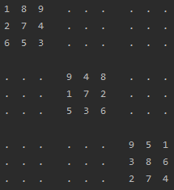
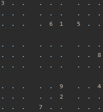
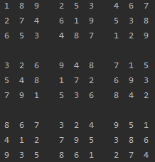

# Sudoku puzzle generator
This is a sudoku puzzle generator project in Kotlin

---
There are two ways to generate random numbers:

| Orthogonal matrix dealer                                 | Few numbers dealer                                       | Result (end result of Orthogonal matrix way)         |
|----------------------------------------------------------|----------------------------------------------------------|------------------------------------------------------|
|  |  |  |
